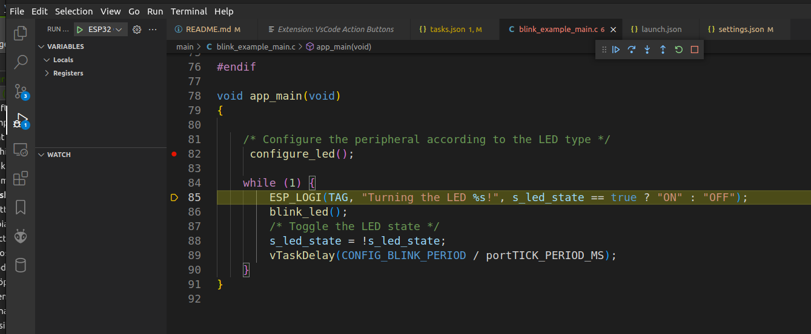
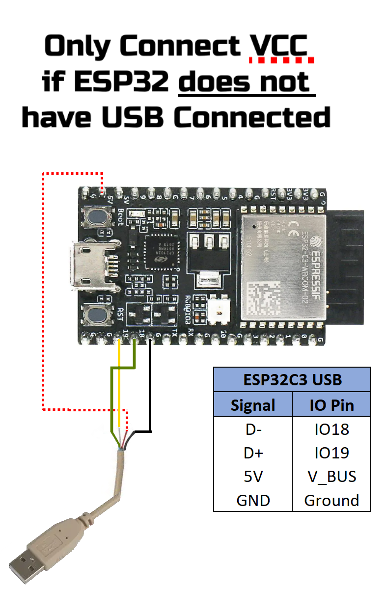
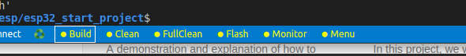
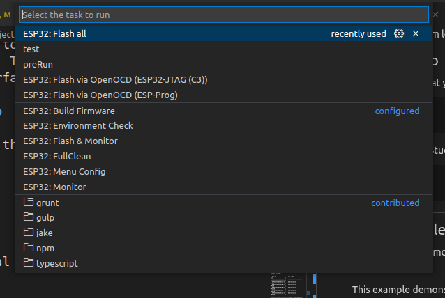

| Supported Targets | ESP32 | ESP32-C2 | ESP32-C3 | ESP32-S2 | ESP32-S3 |
| ----------------- | ----- | -------- | -------- | -------- | -------- |




# ESP32 Start Project on Linux

This project contains tasks, settings etc for a ESP32 development project using eps-idf and Visual Studio Code on Linux. It helps to set up JTAG debugging to ESP32-C3 or using some other JTAG tool.

First of all credits where credits are due

  * Yiri R for his excellent Video series on the subject. https://www.youtube.com/c/YuriR
  * The repository at https://github.com/makercrew/esp_prog_vscode_debug by @makecrew
  * other sources.

This project is just the esp-idf example project "blink". The interesting parts is in the Visual Studio Code configuration files.

Steps to set up are as follows

## Install esp_idf

This is very well described here https://docs.espressif.com/projects/esp-idf/en/latest/esp32/get-started/linux-macos-setup.html. Just follow the instructions.

I recommend adding the following to uour .bashrc after this is done

```sh
# ESP32
export IDF_PATH=/usr/local/src/esp/esp-idf/
alias get_idf='. /usr/local/src/esp/esp-idf/export.sh'
```

Change the path to the path where you have esp-idf installed.

## Start a new project

If you want to start your own project it may be better to start the project in a ned folder and then copy the files for the setup to this project. In this case create a folder and issue

```sh
get_idf
idf.py create_project -p - projectname
```

the necessary files will be created for you. Then copy the files in the .vscode folder to your project and edit the session.json file. You may also create a version.txt file in the root with version information in.

You may also use this project as the base. Then go to the next topic without creating a project.


## Checkout this project

```sh
git clone https://github.com/grodansparadis/esp32_start_project.git
```
Open a terminal and go to the project folder. Issue

```sh
get_idf
```

to get all needed environment variables defined to work with esp_idf

If you have a JTAG adapter. Connect it now. You find good information about it here https://docs.espressif.com/projects/esp-idf/en/latest/esp32c3/api-guides/jtag-debugging/index.html. 

If you are lucky to have the ESP32 C3 wish has built in JTAG interface there is info here https://docs.espressif.com/projects/esp-idf/en/latest/esp32c3/api-guides/jtag-debugging/configure-builtin-jtag.html

You most probably need to add udev rules for the adapter (you complains about permissions). You find ready made files here https://github.com/espressif/openocd-esp32/tree/master/contrib  The **60-openocd.rules** is the file you are interested in. Copy this file to the /etc/udev/rules.d folder. Issue

```sh
udevadm control --reload
```
and disconnect and connect your JTAG adapter.

```sh
sudo dmesg
```

will show you which port the JTAG adapter use.

This is how this looks for an EPS32 C3 directly coupled to a computer through an USB cable

```
[134909.783968] usb 2-1.6.1: USB disconnect, device number 77
[134912.685006] usb 2-1.6.1: new full-speed USB device number 78 using ehci-pci
[134912.899292] usb 2-1.6.1: New USB device found, idVendor=303a, idProduct=1001, bcdDevice= 1.01
[134912.899302] usb 2-1.6.1: New USB device strings: Mfr=1, Product=2, SerialNumber=3
[134912.899305] usb 2-1.6.1: Product: USB JTAG/serial debug unit
[134912.899307] usb 2-1.6.1: Manufacturer: Espressif
[134912.899309] usb 2-1.6.1: SerialNumber: 84:F7:03:08:99:B0
[134912.900024] cdc_acm 2-1.6.1:1.0: ttyACM2: USB ACM device
```

There is two end points. The JTAG endpoint and **/dev/ttyACM2** which is a debug serial port. 

You will get something similar for your JTAG adapter.

Note that if yor development board has a USB interface then you probably have another serial connection from/to the device just as I have here on /dev/ttyUSB0. This is the traditional program load/debug interface.

Connections for an ESP-PROG JTAG adapters

Connections for a JTAG USB cable on the esp32-c3 reversion 3



| ESP-PROG | ESP32 | Description |
| -------- | ----- | ----------- |
| GND | GND | Ground |
| 5V | V_BUS | Power |
| D+ | IO18 | USB data |
| D- | IO19 | USB data |

5V not needed if you power the device from some other source. And yes, you can connect the USB cables directly to the I/O's-

| ESP-PROG | ESP32 | Description |
| -------- | ----- | ----------- |
| GND | GND | Ground |
| 3.3V | 3.3V | Power |
| TCK | IO13 | Clock |
| TDI | IO12 | Data in |
| TDO | IO15 | Data out |
| TMS | IO14 | Mode |

Connections for a generic JTAG adapters

| FTDI pins | ESP32 | Description |
| --------- | ----- | ----------- |
| GND | GND | GND |
| 3.3V | 3.3V | Power |
| AD0/TCK | IO13 | Clock |
| AD1/TDI | IO12 | Data in |
| AD2/TDO | IO15 | Data out |
| AD3/TMS | IO14 | Mode |
| AC3/Reset | EN | Enable |


## Visual Studio

First make sure that you have set the environment variables with

```sh
get_idf
```

Then start Visual Studio Code in the project folder with

```sh
code .
```
**Important**
yes this is the way to start Visual Studio Code if you want things to work for you. 


Set the target build with

```sh
idf.py set-target esp32-c3
```

Replace esp32-c3 with your target.

In the .vscode folder of the project is a file settings.json. Open this file and edit the three top lines

```sh
"idf.adapterTargetName": "esp32c3",
"idf.flashType": "JTAG",
"idf.port": "/dev/ttyUSB0",
```

Set **idf.adapterTargetName** to the name of your target system. This is the same name as you set with set-target above.

Set **idf.flashType** to either "UART" or "JTAG" depending on your debug interface.

Set **idf.port** to the upload/debug port of your system. Using esp32-c3 any of the ports can be set here if you have two. This can be changed in the menuconfig.

If you want to use the short cuts at the bottom of the Visual Studio Code window you also have to set the port in actionButtons commands further down in the settings file (flash & monitor). 



Btw. **VsCode Action Buttons** is an extension by Seun LanLege and if you want to us ethe buttons you need to install it. If you change/add/modify button definitions press F1 and "Refresh Action Buttons" to update.

Press the **build** button and the project should build. Use **flash** to load code ionto the device. This is a convenient way to work.

Tasks are defined to do the same in the tasks.json file. Press **ctrl + alt + T** to select a task to run.  **build** is available here also but can more conveniently be executed with **shift + ctrl + B**



On Linux **ctrl + alt + T** may open the terminal. You can remap this in either Linux or in Visual Studio Code. File/Preferences/Keyboard Shortcuts is where you do this in Visual Studio Code.

Also Terminal/Run Task..." let you select a task to run.

## Flash binaries

First some memory structure for this example. Code is loaded like this

| Address | Description |
| ------- | ----------- |
| 0x0000 | Reserved  (4KB) | 
| 0x1000 | Bootloader (28KB) | 
| 0x8000 | Partition table (4KB) | 
| 0x9000 | Other (4KB) | 
| 0x10000 | Main firmware (2MB/4MB/8MB/16MB) | 

So 

```sh
idf.py -p /dev/ttyUSB0 flash
```

will write the bootloader (*build/bootloader/bootloader.bin*), the partition table (*build/partition_table/partition-table.bin*) and the application firmware (*build/blink.bin*)code to the chip. Convenient and easy.

You can also load code over the JTAG interface. You do this with

```sh
openocd -f board/esp32c3-builtin.cfg -c "program_esp build/blink.bin 0x10000 verify exit"
```
Just adjust the files and the start address to write bootloader and partition table.

If you use the ESP JTAG adapter use

```sh
openocd -f interface/ftdi/esp_usb_jtag.cfg  -f target/esp32.cfg -c "program_esp build/blink.bin 0x10000 verify exit"
```

There are tasks defined for both of these.


To debug on the command line issue

```sh
riscv32-esp-elf-gdb -x gdbinit build/blink.elf
```
But first create a file gdbinit in the same folder wwith this content

```sh
target remote :3333
set remote hardware-watchpoint-limit 2
mon reset halt
flushregs
thb app_main
c
```
This file is already part of this project.

Of of course, again, replace the debug executable (riscv32-esp-elf-gdb) with the one for the processor you use.

More info is here https://docs.espressif.com/projects/esp-idf/en/latest/esp32c3/api-guides/jtag-debugging/using-debugger.html#jtag-debugging-using-debugger-command-line.  Here you also fins ways to start openocd and gdb with idf.py.

## Other tips

Include the path to the idf_folder in the c_cpp_properties.json file typically as below.

```json
{
  "configurations": [
    {
      "name": "Linux",
      "includePath": [
          "${workspaceFolder}/**",
          "/home/akhe/development/esp/esp-idf/**"
      ],
      "defines": [],
      "compilerPath": "/usr/bin/clang",
      "cStandard": "c17",
      "cppStandard": "c++14",
      "intelliSenseMode": "linux-clang-x64",
      "compileCommands": "${workspaceFolder}/build/compile_commands.json"
    }
  ],
  "version": 4
}
```

Intellisense will now find relevant files when you click on a function mane or similar and press F12.

-----
-----
-----

## Blink Example

(See the README.md file in the upper level 'examples' directory for more information about examples.)

This example demonstrates how to blink a LED using GPIO or using the [led_strip](https://components.espressif.com/component/espressif/led_strip) component for the addressable LED, i.e. [WS2812](http://www.world-semi.com/Certifications/WS2812B.html).

The `led_strip` is installed via [component manager](main/idf_component.yml).

### How to Use Example

Before project configuration and build, be sure to set the correct chip target using `idf.py set-target <chip_name>`.

#### Hardware Required

* A development board with Espressif SoC (e.g., ESP32-DevKitC, ESP-WROVER-KIT, etc.)
* A USB cable for Power supply and programming

Some development boards use an addressable LED instead of a regular one. These development boards include:

| Board                | LED type             | Pin                  |
| -------------------- | -------------------- | -------------------- |
| ESP32-C3-DevKitC-1   | Addressable          | GPIO8                |
| ESP32-C3-DevKitM-1   | Addressable          | GPIO8                |
| ESP32-S2-DevKitM-1   | Addressable          | GPIO18               |
| ESP32-S2-Saola-1     | Addressable          | GPIO18               |
| ESP32-S3-DevKitC-1   | Addressable          | GPIO48               |

See [Development Boards](https://www.espressif.com/en/products/devkits) for more information about it.

#### Configure the Project

Open the project configuration menu (`idf.py menuconfig`).

In the `Example Configuration` menu:

* Select the LED type in the `Blink LED type` option.
  * Use `GPIO` for regular LED blink.
* Set the GPIO number used for the signal in the `Blink GPIO number` option.
* Set the blinking period in the `Blink period in ms` option.

#### Build and Flash

Run `idf.py -p PORT flash monitor` to build, flash and monitor the project.

(To exit the serial monitor, type ``Ctrl-]``.)

See the [Getting Started Guide](https://docs.espressif.com/projects/esp-idf/en/latest/get-started/index.html) for full steps to configure and use ESP-IDF to build projects.

### Example Output

As you run the example, you will see the LED blinking, according to the previously defined period. For the addressable LED, you can also change the LED color by setting the `led_strip_set_pixel(led_strip, 0, 16, 16, 16);` (LED Strip, Pixel Number, Red, Green, Blue) with values from 0 to 255 in the [source file](main/blink_example_main.c).

```text
I (315) example: Example configured to blink addressable LED!
I (325) example: Turning the LED OFF!
I (1325) example: Turning the LED ON!
I (2325) example: Turning the LED OFF!
I (3325) example: Turning the LED ON!
I (4325) example: Turning the LED OFF!
I (5325) example: Turning the LED ON!
I (6325) example: Turning the LED OFF!
I (7325) example: Turning the LED ON!
I (8325) example: Turning the LED OFF!
```

Note: The color order could be different according to the LED model.

The pixel number indicates the pixel position in the LED strip. For a single LED, use 0.

### Troubleshooting

* If the LED isn't blinking, check the GPIO or the LED type selection in the `Example Configuration` menu.

For any technical queries, please open an [issue](https://github.com/espressif/esp-idf/issues) on GitHub. We will get back to you soon.
